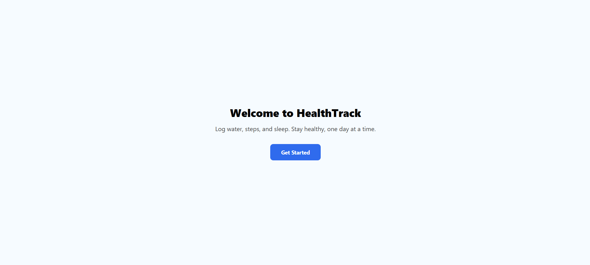
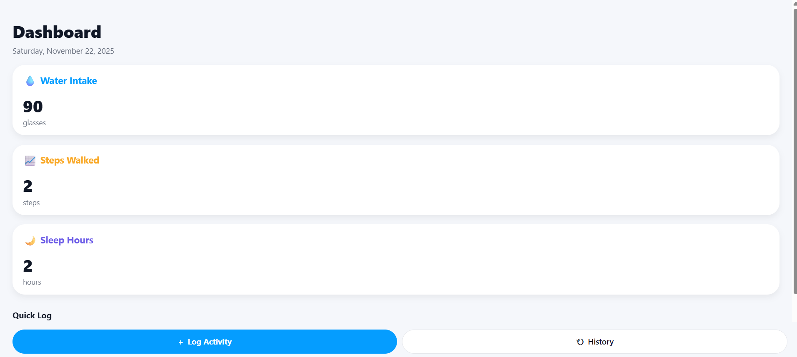
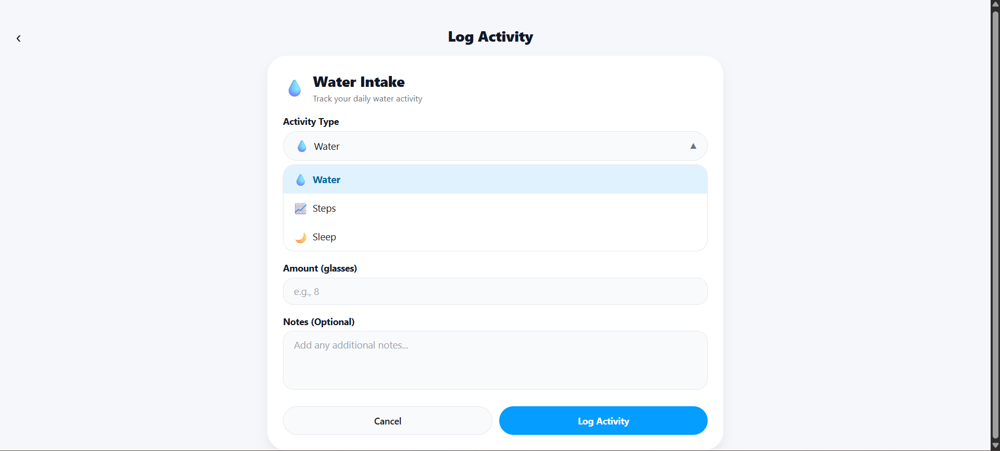

# 📱 Personal Health Tracker – React Native (Expo)

A lightweight mobile application to help users track their **water intake**, **steps walked**, and **sleep duration** — built as part of the **React Native Internship Assignment**.

This app includes onboarding, dashboard analytics, activity logging, and a 7-day history with local data persistence.

---

## 🧾 Features

### 🔹 Onboarding Screen
- Welcome message
- Button to proceed to the main app

### 🔹 Dashboard Screen
- Displays **today’s date**
- Shows **summary cards** for:
  - Water Intake (glasses)
  - Steps Walked
  - Sleep Hours
- **Quick Log buttons** for fast activity input

### 🔹 Log Activity Screen
- Select activity type: **Water / Steps / Sleep**
- Enter value / amount
- Time auto-captured
- Optional notes
- Validation for input
- Save button with alert confirmation

### 🔹 History Screen
- Shows logs from the **last 7 days**
- **Activities grouped by date**
- **Pull-to-refresh** enabled

### 🔹 Data Persistence
- All activity logs stored locally using **AsyncStorage**

---

## 🛠️ Technology Stack

| Category | Tools |
|---------|-------|
| Framework | React Native (Expo) |
| Navigation | React Navigation |
| Storage | AsyncStorage |
| Language | JavaScript |
| Deployment target | Android, iOS, Web (Expo Go) |

---

## 📦 Installation & Setup

Clone the repository:
```bash
git clone https://github.com/<your-username>/Personal-Health-Tracker.git
cd Personal-Health-Tracker
```

## 📸 App Screenshots

### 🏠 Dashboard


### ➕ Log Activity



